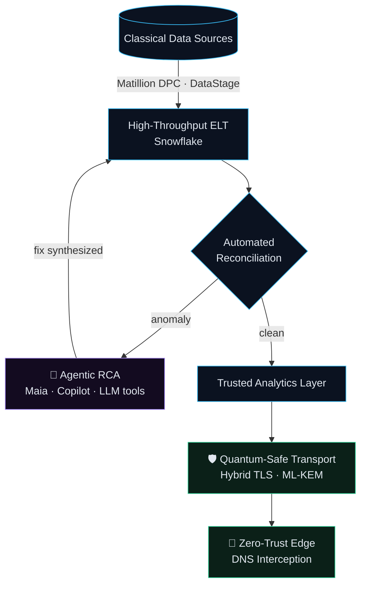

<!--
  👋 You're reading the raw markdown. That's my kind of engineer.
  Session key: "the future does not compute in classical bits alone"
  → Say hi with the subject line "raw-reader" and I'll know.
-->

<div align="center">

```
   █████╗ ██████╗ ██╗  ██╗██╗███╗   ██╗ █████╗ ██╗   ██╗
  ██╔══██╗██╔══██╗██║  ██║██║████╗  ██║██╔══██╗██║   ██║
  ███████║██████╔╝███████║██║██╔██╗ ██║███████║██║   ██║
  ██╔══██║██╔══██╗██╔══██║██║██║╚██╗██║██╔══██║╚██╗ ██╔╝
  ██║  ██║██████╔╝██║  ██║██║██║ ╚████║██║  ██║ ╚████╔╝ 
  ╚═╝  ╚═╝╚═════╝ ╚═╝  ╚═╝╚═╝╚═╝  ╚═══╝╚═╝  ╚═╝  ╚═══╝  
```

```console
$ ssh abhinav@velith.systems -o KexAlgorithms=mlkem768x25519-sha256
→ hybrid key exchange negotiated · classical + post-quantum · session secure
```

**Data & AI Systems Engineer @ HCLTech** · Founder, **Velith Systems** · Noida, India

*Deterministic data pipelines · Autonomous cognitive agents · Quantum-safe trust*

[](https://abhinavdwivedi.pro)
[](https://linkedin.com/in/abhi-astral)
[](https://github.com/velithsoftware)
[](mailto:abhinavd372@gmail.com)

</div>

---

### `0x01` ClientHello - *who's on the other end*

By day I build and modernize enterprise data platforms on **Snowflake, Matillion DPC, and IBM DataStage**, and bring **agentic AI** into everyday engineering: automated reconciliation, AI-assisted root-cause analysis, and generated transformation logic.

By night, through **[Velith Systems](https://github.com/velithsoftware)**, I build security software for the cryptographic transition: zero-trust DNS interception and post-quantum migration tools aligned with **NIST FIPS 203/204** and **CNSA 2.0**.

> [!IMPORTANT]
> **Harvest Now, Decrypt Later** is already happening. Encrypted traffic recorded today can be broken by tomorrow's quantum computers. My work is about migrating *before* that happens.

---

### `0x02` KeyExchange — *how the pieces connect*



---

### `0x03` Certificate — *proof of work*

<table width="100%">
<tr>
<td width="50%" valign="top">

#### ⚡ [terminator_sec](https://github.com/velithsoftware/terminator_sec)
*Ultra-lightweight endpoint threat interception*

- **Zero-trust DNS proxy:** scores domain risk on the host *before* a connection opens
- **3-tier engine:** Radix tries → Bloom filters → Shannon entropy (detects algorithmically generated botnet domains)
- **Stack:** Go · Swift agent · WebSocket telemetry · Linux / macOS / Windows

<details>
<summary>🔓 <b>decrypt: benchmarks</b></summary>
<br/>

| Metric | Result |
| :-- | --: |
| Lookup latency p50 / p99 | `X.X ms / X.X ms` |
| Bloom filter false-positive rate | `X.XX %` |
| Blocklist size held in memory | `X M domains` |
| Agent memory footprint | `XX MB` |

<sub>Hardware: `<CPU/RAM>` · Method: `<tool, sample size>`</sub>
</details>

</td>
<td width="50%" valign="top">

#### ⚛️ [post_quantum_defence_suite](https://github.com/velithsoftware/post_quantum_defence_suite)
*End-to-end crypto-agility & migration engine*

- **CBOM discovery:** scans for vulnerable classical crypto (RSA / ECC / SHA-1)
- **Hybrid TLS edge proxy:** negotiates **ML-KEM** key exchange in front of legacy services
- **Quantum PKI:** dual-signature X.509 CA (**ML-DSA**) + stateful **LMS** signer (RFC 8554)

<details>
<summary>🔓 <b>decrypt: standards coverage</b></summary>
<br/>

| Standard | Status |
| :-- | :-: |
| FIPS 203 · ML-KEM | ✅ |
| FIPS 204 · ML-DSA | ✅ |
| RFC 8554 · LMS | ✅ |
| CNSA 2.0 alignment | 🟡 in progress |

</details>

</td>
</tr>
</table>

---

### `0x04` CipherSuites — *negotiated capabilities*

<details>
<summary>🔓 <b>decrypt: full technology matrix</b></summary>

```yaml
Data_Platforms:
  warehouses:   [ Snowflake, Cloud Data Lakes, PostgreSQL ]
  etl_elt:      [ Matillion DPC, IBM DataStage, Apache Airflow ]
  modelling:    [ Dimensional / Star Schema, CDC, Schema Evolution ]

Cognitive_AI:
  paradigms:    [ Multi-Agent Workflows, Tool Use / Function Calling, RAG ]
  tooling:      [ Matillion Maia, Microsoft Copilot, LangChain, Vector Embeddings ]
  services:     [ FastAPI, Python Microservices, Event-Driven Daemons ]

Systems_&_Defense:
  cryptography: [ FIPS 203 (ML-KEM), FIPS 204 (ML-DSA), RFC 8554 (LMS), Hybrid TLS ]
  networking:   [ Host-level DNS Interception, Packet Inspection, Zero-Trust ]

Languages_&_Infra:
  languages:    [ SQL, Python, Go, Java, Swift, Bash ]
  devops:       [ Azure DevOps CI/CD, Docker, Linux Internals, Git ]
```

</details>

---

### `0x05` Transcript — *what I've written & what I'm learning*

- 📄 **[Cybersecurity and Prevention in the Quantum Era](LINK_TO_PDF_OR_DOI)**: how quantum attacks threaten public-key infrastructure, and a practical plan for enterprises moving to post-quantum standards.

**Field log** <sub>(updated automatically)</sub>
<!-- FIELD_LOG:START -->
- 🔬 Exploring: hybrid ML-KEM performance overhead in TLS 1.3 handshakes
- 🤖 Building: agentic RCA for pipeline reconciliation failures
- 📚 Reading: *Designing Data-Intensive Applications*
<!-- FIELD_LOG:END -->

---

### `0x06` Finished — *handshake complete*

<div align="center">

```diff
+ session established · forward secrecy: quantum-resistant
+ open to: data/AI platform roles · PQC collaboration · security research
```

*"The future does not compute in classical bits alone."*

</div>
